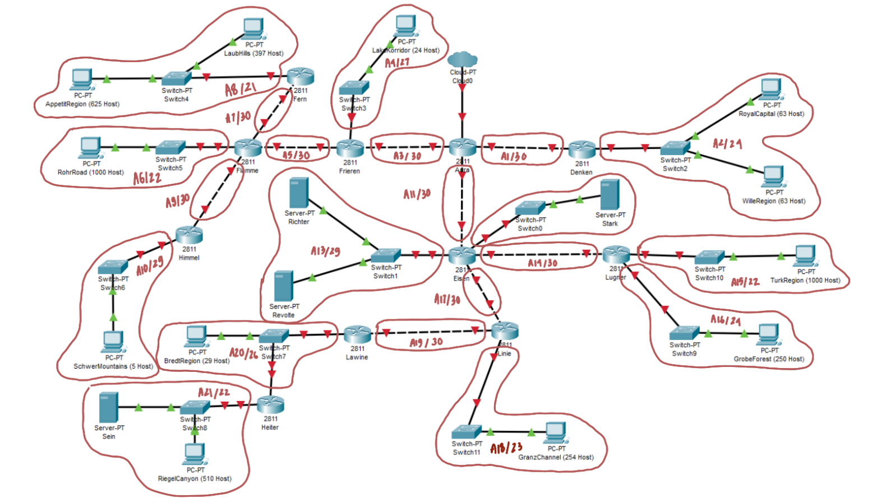

# Laporan Resmi Praktikum Jaringan Komputer - Modul 4 IT 20

> Annisa Rahmapuri - 5027211018
> 

> Abdul Zaki Syahrul Rahmat - 502721120
> 

## CPT *menggunakan VLSM*
- Menentukan jumlah subnet awal pada topologi, seperti gambar berikut :

## *GNS menggunakan CIDR*

### Penggabungan IP

- Menentukan jumlah subnet awal pada topologi, seperti gambar berikut :
    
    
    
    | Rute | Subnet | Jumlah IP  | Lenght |
    | --- | --- | --- | --- |
    | Fern-Switch4-LaubHills-Switch4-AppetitRegion | A8  | 1023 | /21 |
    | Fern-Flamme | A7 | 2 | /30 |
    | Flamme-Switch5-RohrRoad | A6 | 1001 | /22 |
    | Flamme-Himmel | A9 | 2 | /30 |
    | Himmel-Switch6-SchwerMountains | A10 | 6 | /29 |
    | Flamme-Frieren | A5 | 2 | /30 |
    | Frieren-Switch3-LakeKorridor | A4 | 25 | /27 |
    | Frieren-Aura | A3 | 2 | /30 |
    | Aura-Denken | A1 | 2 | /30 |
    | Denken-Switch2-RoyalCapital-Switch2-WileRegion | A2 | 127 | /24 |
    | Aura-Eisen | A11 | 2 | /30 |
    | Eisen-Switch1-Richter-Switch1-Revolte | A13 | 3 | /29 |
    | Eisen-Switch0-Stark | A12 | 2 | /30 |
    | Eisen-Lugner | A14 | 2 | /30 |
    | Lugner-Switch10-TurkRegion | A15 | 1001 | /22 |
    | Lugner-Switch9-GrobeForest | A16 | 251 | /24 |
    | Eisen-Linie | A17 | 2 | /30 |
    | Linie-Switch11-GranzChannel | A18 | 255 | /23 |
    | Linie-Lawine | A19 | 2 | /30 |
    | Lawine-Switch7-Heiter-Switch7-BredtRegion | A20 | 31 | /26 |
    | Heiter-Switch8-Sein-Switch8-RiegelCanyon | A21 | 512 | /22 |
- Penggabungan Subnet
    - Penggabungan A → B
        
        
        
        
        
    - Penggabungan B → C
        
        
        
        
        
    - Penggabungan C → D
        
        
        
        
        
    - Penggabungan D → E
        
        
        
        
        
    - Penggabungan E → F
        
        
        
        
        
    - Penggabungan F → G
        
        
        
        
        
    - Penggabungan G → H
        
        
        
        
        
    - Penggabungan H → I
        
        
        
        
        
    
    Berdasarkan total IP dan netmask yang dibutuhkan, Subnet besar yang dibentuk memiliki `NID 192.243.0.0` dengan `Length /14`. 
    
    ### **Menghitung pembagian IP berdasarkan `NID` dan `Lenght` yang didapatkan**
    
    
    
    Berdasarkan tree di atas serta perhitungan yang ada, dapat disimpulkan pembagian IP pada masing masing subnet sebagai berikut : 
    
    
